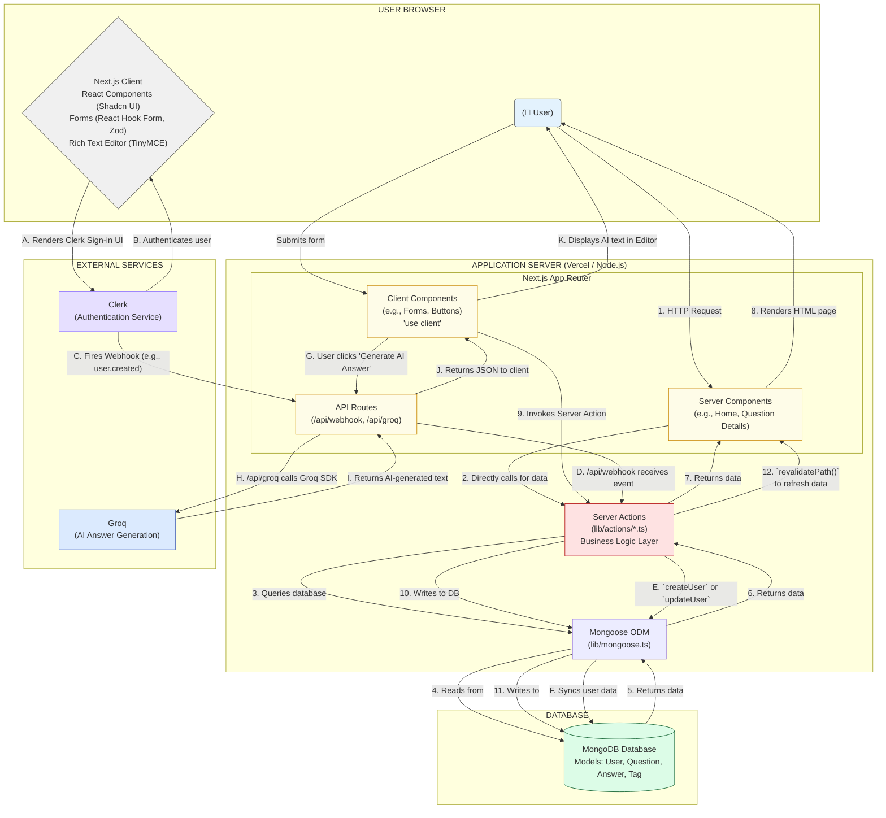

# ARCHITECTURE.md

# Dev Overflow Architecture

This document provides an overview of the system architecture, folder structure, major components, data flow, and key design decisions for the Dev Overflow project.

## 1. System Architecture Overview

Dev Overflow is a **monolithic full-stack web application** built with **Next.js 14** utilizing its **App Router**.

- **Frontend:** Rendered using React Server Components (RSC) and Client Components where interactivity is needed. Leverages Next.js routing, pre-fetching, and UI built with shadcn/ui and Tailwind CSS.
- **Backend:** Integrated within the Next.js framework using:
  - **Server Actions:** For handling mutations (creating, updating, deleting data) directly from components, simplifying data submission and reducing API boilerplate.
  - **API Routes:** For specific backend tasks like handling webhooks (Clerk) and interacting with external services (Groq AI).
- **Database:** MongoDB is used as the primary data store, accessed via Mongoose ODM for schema definition and data manipulation within Server Actions and API Routes.
- **Authentication:** Clerk handles user management, authentication state, and session management, integrating tightly with Next.js middleware and components.
- **External Services:**
  - **Groq:** Provides AI capabilities for generating answer suggestions.
  - **TinyMCE:** Powers the rich text editor for questions and answers.
  - **Svix:** Used by Clerk to securely deliver webhook events.

The architecture aims for a streamlined development experience by co-locating frontend and backend logic within the Next.js framework, leveraging modern features like Server Components and Server Actions for performance and efficiency.



## 2. Project Folder Structure

```
/
├── app/                  # Next.js App Router: Routing, Layouts, Pages, API Routes
│   ├── (auth)/           # Authentication routes (Sign In, Sign Up) - Route Group
│   ├── (root)/           # Main application routes (protected & public) - Route Group
│   │   ├── (home)/       # Home page specific route group
│   │   ├── ask-question/ # Page for asking questions
│   │   ├── collection/   # Page for saved questions
│   │   ├── community/    # Page listing users
│   │   ├── profile/      # User profile pages (view, edit)
│   │   ├── question/     # Question detail and edit pages
│   │   └── tags/         # Pages for listing tags and questions by tag
│   ├── api/              # API Routes
│   │   ├── groq/         # API for interacting with Groq AI
│   │   └── webhook/      # API for handling Clerk webhooks
│   ├── layout.tsx        # Root layout (includes ClerkProvider, ThemeProvider)
│   └── globals.css       # Global styles
├── components/           # Reusable React components
│   ├── cards/            # Card components (Question, User, Answer)
│   ├── forms/            # Form components (Question, Answer, Profile)
│   ├── home/             # Components specific to the home page (e.g., filters)
│   ├── shared/           # Common components used across multiple pages (Navbar, Sidebar, Search, etc.)
│   └── ui/               # shadcn/ui components (Button, Input, etc.)
├── constants/            # Project constants (sidebar links, filters, badge criteria)
├── context/              # React Context providers (ThemeProvider)
├── database/             # Mongoose models/schemas (User, Question, Answer, Tag, Interaction)
├── lib/                  # Core logic, utilities, server actions
│   ├── actions/          # Server Actions for database operations (CRUD for users, questions, etc.)
│   ├── mongoose.ts       # MongoDB connection logic
│   ├── utils.ts          # Utility functions (date formatting, URL manipulation, badge assignment)
│   └── validations.ts    # Zod schemas for form validation
├── public/               # Static assets (images, icons)
├── styles/               # Additional CSS files (PrismJS theme, custom theme utilities)
├── types/                # TypeScript type definitions
├── .env.example          # Example environment variables file
├── middleware.ts         # Next.js middleware (Clerk authentication enforcement)
├── next.config.js        # Next.js configuration
├── package.json          # Project dependencies and scripts
├── tailwind.config.ts    # Tailwind CSS configuration
└── tsconfig.json         # TypeScript configuration
```

## 3. Major Components

- **Next.js App Router (`app/`)**:
  - Handles file-system based routing.
  - Uses Route Groups `(auth)`, `(root)`, `(home)` for organization without affecting URL paths.
  - Implements nested layouts (`layout.tsx`) for shared UI structures.
  - Utilizes `page.tsx` for page UI, `loading.tsx` for instant loading states, and `error.tsx` (implicitly) for error handling.
  - Contains API routes (`app/api/`) for backend endpoints.
- **UI Components (`components/`)**:
  - Built with React and styled using Tailwind CSS.
  - Leverages **shadcn/ui** (`components/ui/`) for foundational, accessible components.
  - Organized by feature (`cards`, `forms`, `home`) or scope (`shared`).
  - Includes interactive elements like search bars, filters, navigation, and voting widgets.
- **Server Actions (`lib/actions/`)**:
  - TypeScript functions marked with `"use server"`.
  - Encapsulate backend logic for data fetching and mutations (CRUD operations).
  - Interact directly with the database models.
  - Called from Server and Client Components, reducing the need for separate API endpoints for many operations.
  - Use `revalidatePath` to update cached data after mutations.
- **Database Models (`database/`)**:
  - Mongoose schemas defining the structure for Users, Questions, Answers, Tags, and Interactions.
  - Establish relationships between different data entities (e.g., a Question has an author (User) and multiple tags (Tag)).
- **Authentication (`middleware.ts`, `ClerkProvider`, `UserButton`)**:
  - **Clerk** manages user sign-up, sign-in, session handling.
  - **Middleware (`middleware.ts`)** protects routes, redirecting unauthenticated users based on `publicRoutes` and `ignoredRoutes`.
  - `ClerkProvider` wraps the application in `app/layout.tsx` to provide auth context.
  - Components like `SignedIn`, `SignedOut`, `UserButton` control UI based on auth state.
- **State Management (`context/ThemeProvider.tsx`)**:
  - Uses React Context API primarily for global state like the theme (light/dark mode). Other state is managed locally within components or derived from server data.
- **AI Integration (`app/api/groq/route.ts`, `components/forms/Answer.tsx`)**:
  - Frontend triggers an API call.
  - The API route securely communicates with the Groq service using an API key.
  - Returns the AI-generated content to the frontend.

## 4. Data Flow Examples

1.  **User Asks a Question:**

    - User fills `Question` form (`components/forms/Question.tsx`).
    - On submit, the form calls the `createQuestion` Server Action (`lib/actions/question.action.ts`).
    - Server Action validates data, interacts with `Question`, `Tag`, `User`, and `Interaction` models in MongoDB.
    - Increments user reputation.
    - Calls `revalidatePath('/')` to update the home page cache.
    - Redirects user (e.g., to home page).

2.  **User Votes on an Answer:**

    - User clicks upvote/downvote on `Votes` component (`components/shared/Votes.tsx`).
    - `Votes` component calls `upvoteAnswer` or `downvoteAnswer` Server Action (`lib/actions/answer.action.ts`), passing IDs and current vote state.
    - Server Action updates the `Answer` model (adding/removing user ID from `upvotes`/`downvotes`) and updates `User` reputation for both voter and author.
    - Calls `revalidatePath()` for the current question page path.
    - Frontend UI updates optimistically or upon revalidation.

3.  **User Signs Up:**

    - User interacts with Clerk's Sign Up component (`app/(auth)/sign-up/[[...sign-up]]/page.tsx`).
    - Clerk handles the sign-up process.
    - On successful creation, Clerk triggers a webhook event (`user.created`).
    - The webhook request hits the `app/api/webhook/route.ts` endpoint.
    - The webhook handler verifies the request using Svix and the `WEBHOOK_SECRET`.
    - It calls the `createUser` Server Action (`lib/actions/user.action.ts`) to create a corresponding user record in the MongoDB database.

4.  **User Generates AI Answer:**
    - User clicks "Generate AI Answer" in `Answer` form (`components/forms/Answer.tsx`).
    - An async function `generateAIAnswer` in the component makes a `fetch` request to `/api/groq`.
    - The API route (`app/api/groq/route.ts`) receives the question context.
    - It calls the Groq SDK using the `GROQ_API_KEY`.
    - Groq service processes the request and returns an AI-generated answer.
    - The API route sends the reply back to the frontend component.
    - The component updates the TinyMCE editor content with the AI response.

## 5. Key Design Decisions

- **Next.js App Router:** Chosen for its modern features like Server Components (reducing client-side JS), Server Actions (simplifying data mutations), improved data fetching patterns, and built-in optimizations like routing and code splitting.
- **TypeScript:** Used throughout the project for improved type safety, developer experience, and code maintainability, especially crucial in larger applications.
- **Tailwind CSS & shadcn/ui:** Selected for rapid UI development. Tailwind provides utility classes, while shadcn/ui offers unstyled, accessible base components that are easily customizable.
- **MongoDB & Mongoose:** A flexible NoSQL database suitable for evolving schemas. Mongoose provides structure and validation. Common choice in the Node.js/JavaScript ecosystem.
- **Clerk:** Offloads the complexity of authentication and user management, providing robust security features and pre-built UI components. Webhooks ensure data synchronization.
- **Server Actions:** Preferred over traditional API routes for most CRUD operations to simplify code, improve type safety between client and server, and potentially reduce latency by co-locating logic.
- **Groq:** Chosen for AI features potentially due to its speed and ease of integration via its SDK.
- **Modular Structure:** Code is organized into logical folders (`components`, `lib`, `database`, `constants`) to promote reusability and maintainability. Shared components and utilities are clearly separated.
- **Context for Theme:** Minimal use of client-side global state; React Context is sufficient for managing the theme toggle.
